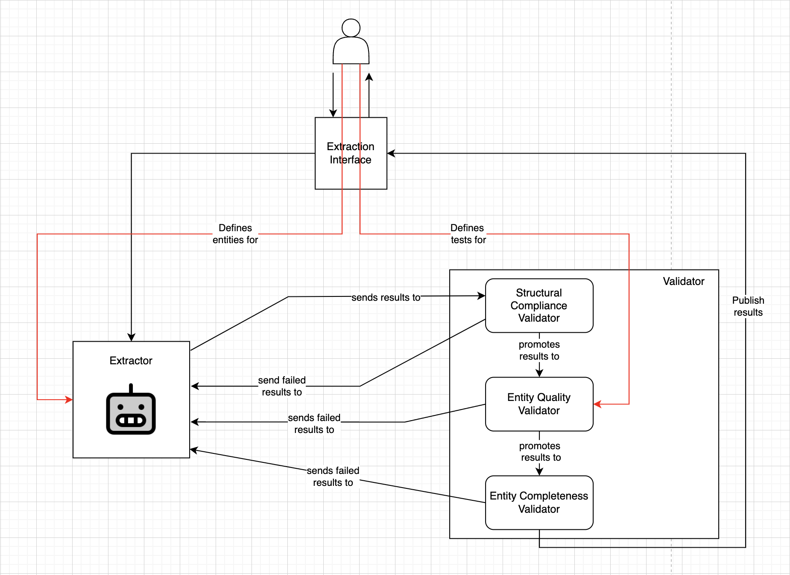

# Extraction Module for Databricks

This Python module extracts structured entities from unstructured text columns in a Spark DataFrame. It allows users to define entity descriptions and apply extraction across specified columns. Additionally, validation tests can be applied to ensure the correctness of extracted entities.

## Table of Contents
- [Features](#features)
- [Overview](#functionality-overview)
- [Installation](#installation)
    - [Local installation](#local-installation)
    - [Databricks installation](#databricks-installation)
- [Usage](#usage)

## Overview

The following diagram defines the functionality of the extraction. (For updates, please use the file `./docs/Extraction.drawio`)



The extraction module is designed to extract entities over free-text columns in a spark dataframe.
The user defines entities to be extracted in free text format, and the mentioned entities are then sent over to the extractor which leverages an LLM to extract them.
Along with the extraction, the user can also defines validation tests, which are carried out after the extraction.

### Features

#### Extraction

The extractor leverages an LLM (in the Chat format) to extract the mentioned entities.
It is assumed that the input spark dataframe contains primary keys, which are then used to batch inputs to the LLM.

#### Validation

Three types of validations are run:

1. Structural Compliance Validation: this part checks that the extraction process preserves the input structure (e.g. no new records are generated during the extraction)

2. Entity Quality Validation: if validation tests are provided for the entities, they are carried out on this stage.

3. (not implemented yet) Entity Completeness: validate that all entities are extracted.

## Installation
You can install the package in one of the following ways.

### Local installation

To install the package ensure you have Python installed, and run

```bash
pip install extraction@git+"https://ksb-ops@dev.azure.com/ksb-ops/ExtractionModule/_git/ExtractionModule"
```
The package is installed in a private mode, so permission to download it needs to be granted.

### Databricks installation

To install the package in a cluster follow these instructions: [Databricks Installation](./docs/databricks_installation.md)

## Usage
Below is an example of how to use the extraction module in a Databricks notebook:

```python
from langchain_openai import AzureChatOpenAI
from pyspark.sql import SparkSession
from pyspark.sql.functions import col

from extraction.extraction import StructuredExtraction
from extraction.entities.extraction_entity import ExtractionEntity

# Define the llm to use
llm = AzureChatOpenAI(
    azure_endpoint=...,
    api_key=...,
    temperature=0.0,
)

# Define the spark session
spark = SparkSession.builder.appName("Extraction").getOrCreate()

# Create a sample dataframe
data = spark.createDataFrame([
    (1, "Welti Petra könnte auch an einer anderen Erkrankung gelitten haben, die zum Herzversagen führte, z. B. an einer Myokarditis oder an einer Kardiomyopathie."),
     (2, "Steiner Nicolas hätte möglicherweise von einer Herztransplantation profitiert."),
     (3, "Die Therapie mit Sauerstoff, Nitroglycerin, Betablockern, ACE-Hemmern und Gefäßdilatatoren war möglicherweise nicht ausreichend, um bei Caviezel Nicolas den kardiogenen Schock zu verhindern."),
], ["id", "Beschrieb"])

# Define the entities to be extracted
name = ExtractionEntity(
    name="name",
    instructions="Extract the names of people in the dataset. Do not add any other information",
)

extraction = StructuredExtraction(
    entities=[name],
)

data_extracted = extraction.fit_extract(
    df=data.filter(col("Beschrieb").isNotNull()),
    llm=llm,
    primary_keys=['id'],
    input_columns=["Beschrieb"],
    batch_size=50,
)

joined = data.join(data_extracted, on="id", how="left")

joined.show()
```

**Important**: make sure that the language model which is served to the extraction module is in the Chat version, not in the LLM one.
